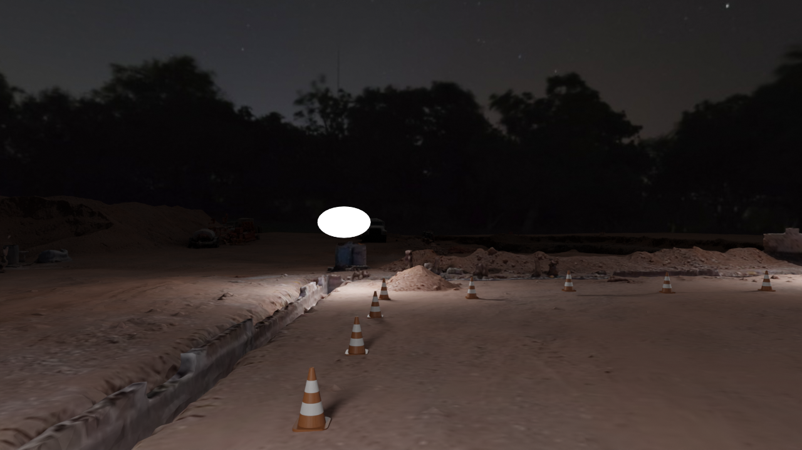

**Event camera** captures spatial-temporal gradients of light intensity. A normal RGB image looks like this: <br>

<br>
, while output of an event camera looks like this:
<br>

<br>

Denoting $`L(x,y,t)`$ as the light intensity at pixel $`(x,y)`$ and time $`t`$, instead of recording the light intensity, event cameras record the abrupt change in $`L`$. An event $`e_i=(x_i, y_i, p_i, t_i)`$ for pixel $`(x_i, y_i)`$ is triggered when
<br>
$$
    |\log{L(x_i, y_i, t_i)} - \log{L(x_i, y_i, t_{i-1})}| \geq C,
$$
<br>
where C is the constant for threshold. And $`p_i`$ is the sign of log brightness change.
<br>
$$
p_i = {\rm sign}(\log{L(x_i, y_i, t_i)}-\log{L(x_i, y_i, t_{i-1})}).
$$
<br>

```
Because event camera captures temporal gradients of light field intensity, it is much faster than normal integration-based camera!
```
<!-- [Link to another page](./another-page.html). -->